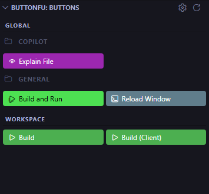
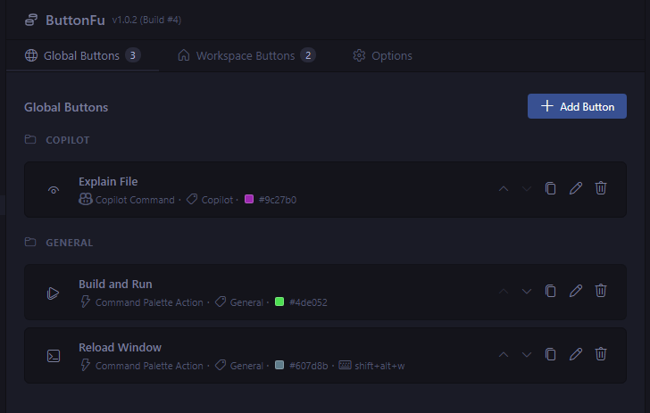
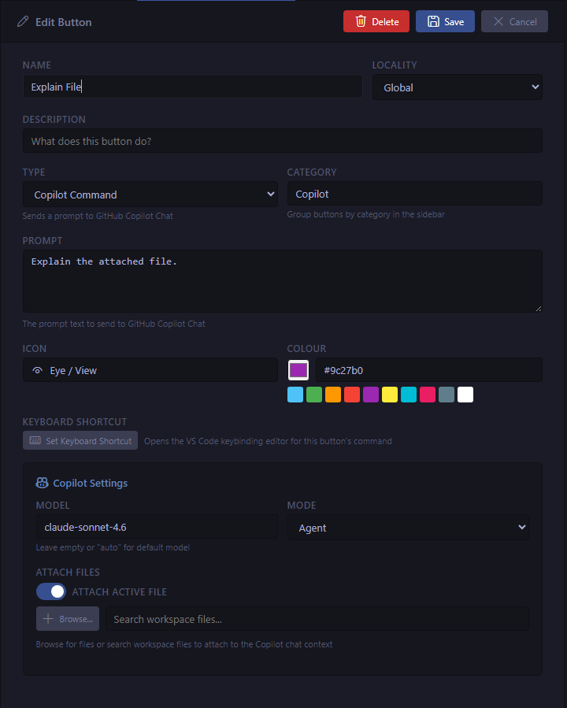

# ButtonFu

**Stop hunting through menus. Put your most-used actions one click away.**

ButtonFu adds a fully customisable button panel to the VS Code sidebar. Run terminal commands, trigger palette actions, execute tasks, or fire off a Copilot prompt — all without leaving your flow.

---

## Install

Open VS Code, press `Ctrl+Shift+X` to open the Extensions panel, search for **ButtonFu**, and click **Install**. The sidebar icon appears immediately.

---

## What can a button do?

| Type | What it does |
|------|--------------|
| **Terminal Command** | Runs shell commands in the integrated terminal — supports multiple named tabs running in parallel or in sequence |
| **Command Palette Action** | Executes any VS Code command by ID, with optional JSON arguments |
| **Task Execution** | Runs a task discovered from your workspace or extensions |
| **Copilot Command** | Sends a prompt to GitHub Copilot Chat, with model, mode, and file attachments |

---

## Global & Workspace buttons

Buttons come in two scopes. **Global** buttons are stored in your VS Code user settings and appear in every workspace — perfect for commands you use everywhere, like reloading the window or opening a terminal profile. **Workspace** buttons live in workspace state and are scoped to the current project — handy for project-specific build scripts, deployment commands, or Copilot prompts tailored to your codebase.

Both scopes show up together in the sidebar panel, clearly labelled, so you always know what you're clicking.

---

## The button editor

Click the gear icon in the panel header to open the full button editor. All your buttons are listed in one place — sortable, categorised, and easy to manage.

Click any button to edit it, or hit **+ Add Button** to create a new one. Every button has:

- A **name**, **description**, and **category** for organisation
- A **type** that determines what it executes
- A **codicon icon** picked from a searchable grid
- An optional **colour** (vivid or pastel presets, or any hex value) to make important buttons stand out at a glance
- A **keyboard shortcut** you can assign directly from the editor
- An optional **warn before execution** toggle that requires a confirmation click before the command runs

---

## Multi-terminal execution

Terminal Command buttons can define **multiple named tabs**, each with their own commands. By default all tabs fire simultaneously, each opening its own terminal. Enable the **Dependant On Previous Terminal Success** flag on a tab to switch to sequential mode — that tab only runs if the previous one exited cleanly, and the chain halts on the first failure.

Manage tabs from the editor: add, rename (double-click or F2), delete, and reorder left/right. Each terminal is labelled `ButtonFu: <button name> — <tab name>` so you can tell them apart at a glance.

---

## Tokens

Embed `$TokenName$` placeholders anywhere in a command or Copilot prompt. ButtonFu resolves them at execution time — no hard-coding file paths or branch names.

**26 built-in system tokens** are resolved automatically, including:

| Token | Resolves to |
|-------|-------------|
| `$WorkspacePath$` | Root path of the workspace |
| `$ActiveFileName$` | File name of the active editor |
| `$SelectedText$` | Currently selected text |
| `$GitBranch$` | Current git branch |
| `$Clipboard$` | Current clipboard contents |
| `$DateTime$` | ISO 8601 timestamp |
| `$RandomUUID$` | A freshly generated UUID |

…and more: active file extension, directory, relative path, line/column number, current line text, platform, hostname, username, home/temp directories, path separator, EOL, and button name/type.

**User tokens** let you define your own per-button inputs with a name, data type (String, Multi-Line String, Integer, or Boolean), label, description, optional default, and a Required flag. When you click a button that has unresolved user tokens, a questionnaire panel appears to collect their values before execution — with a live preview showing every token fully resolved.

Tokens can be dragged directly from the token table into the command field, inserting them at the cursor.

---

## Copilot integration

Copilot Command buttons let you build reusable AI workflows. Choose your **model** (with autocomplete across all your available models), set the **mode** (Agent, Ask, Edit, or Plan), and attach files that should always be part of the conversation — including a toggle to automatically attach whichever file you currently have open.

Tokens work in Copilot prompts too, letting you build dynamic prompts built around the active file, selected text, or any user-provided input.

When you click the button, ButtonFu opens a fresh chat session, sets the mode and model, attaches any files, and submits your prompt — all in one click.

---

## Organise with categories

Group related buttons under a **category** label. Categories appear as section headers in both the editor list and the sidebar panel, so your workspace stays tidy even as your button collection grows. Buttons can be reordered within their group using the up/down arrows in the editor.
