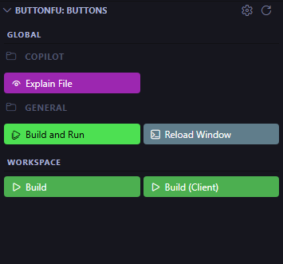
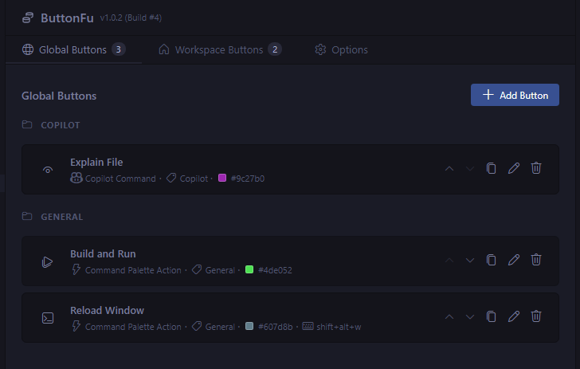
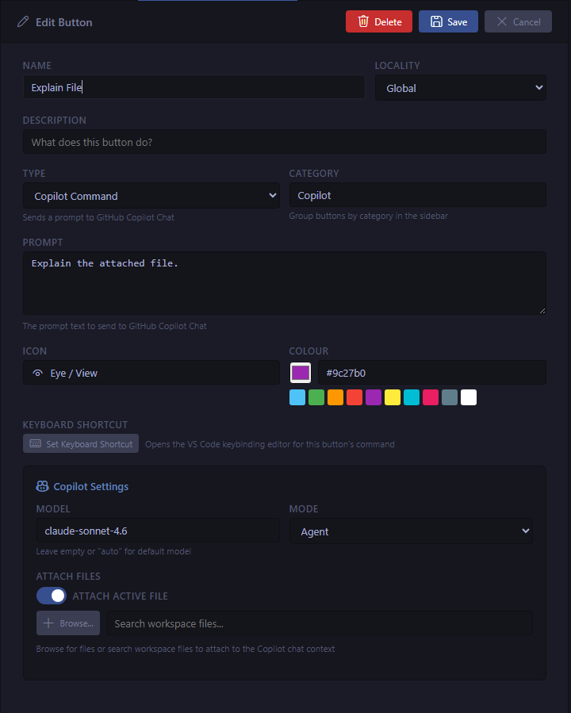

# ButtonFu

**Stop hunting through menus. Put your most-used actions one click away.**

ButtonFu adds a fully customisable button panel to the VS Code sidebar. Run terminal commands, trigger palette actions, execute tasks, or fire off a Copilot prompt — all without leaving your flow.



---

## Install

Open VS Code, press `Ctrl+Shift+X` to open the Extensions panel, search for **ButtonFu**, and click **Install**. The sidebar icon appears immediately.

---

## Development

Open the repository root in VS Code and press F5. The checked-in launch configuration in `.vscode/launch.json` runs the existing `npm: compile - buttonfu-extension` task first, then starts an Extension Development Host with the extension loaded from `buttonfu-extension`. The compile step also syntax-checks the extracted editor webview script at `buttonfu-extension/resources/editor.js`, so editor-side JS parse errors fail fast during development.

For a live end-to-end check against a real Extension Development Host, run `npm run test:drive-net` from `buttonfu-extension`. The checked-in Drive.NET manifest covers sidebar activation, note CRUD, button editor CRUD, and the workspace note row inside the editor list.

The repository-root `README.md`, `CHANGELOG.md`, `LICENSE`, and `README_PIC*.png` files are the source of truth. From the repository root, run `npm run sync-package-files --prefix buttonfu-extension` to refresh the package-local copies inside `buttonfu-extension` and hash-verify them before packaging.

Installer builds also read their version and repository URL from `buttonfu-extension/package.json`, which keeps the shipped support/update links aligned with the extension metadata.

---

## What can a button do?

| Type | What it does |
|------|--------------|
| **Terminal Command** | Runs shell commands in the integrated terminal — supports multiple named tabs running in parallel or in sequence |
| **Command Palette Action** | Executes any VS Code command by ID, with optional JSON arguments |
| **Task Execution** | Runs a task discovered from your workspace or extensions |
| **Copilot Command** | Sends a prompt to GitHub Copilot Chat, with model, mode, and file attachments |
| **Claude Command** | Starts a Claude Code session with the prompt already running, in a terminal, a new window, or the Claude panel |

---

## Global & Workspace buttons

Buttons come in two scopes. **Global** buttons are stored in your VS Code user settings and appear in every workspace — perfect for commands you use everywhere, like reloading the window or opening a terminal profile. **Workspace** buttons live in workspace state and are scoped to the current project — handy for project-specific build scripts, deployment commands, or Copilot prompts tailored to your codebase.

Both scopes show up together in the sidebar panel, clearly labelled, so you always know what you're clicking.

### Repo-committed buttons (`buttonfu.workspaceButtons`)

A repository can also ship its own buttons in git via the **`buttonfu.workspaceButtons`** setting in `.vscode/settings.json`. These render in the workspace section grouped by category and execute like any other button (including `warnBeforeExecution` confirmation dialogs), but they are **read-only in the UI** — edit and delete are disabled, because the source of truth is the committed settings file. Entries need no `id`; a stable id is derived from the name, category, and execution text. Only `name` is required — `type` defaults to `TerminalCommand`, `category` to `General`, and `icon` to `play`.

```json
"buttonfu.workspaceButtons": [
  { "name": "Run Local", "category": "PDF Whiffle", "icon": "play",
    "type": "TerminalCommand",
    "executionText": "pwsh -File build.ps1; dotnet run --project PdfWhiffle.Web" },
  { "name": "Deploy PDF Whiffle", "category": "PDF Whiffle", "icon": "rocket",
    "type": "TerminalCommand", "warnBeforeExecution": true,
    "executionText": "pwsh -File ..\\HiroixHost\\deploy\\deploy.ps1 -Site pdfwhiffle" }
]
```

---

## Notes & prompts

ButtonFu notes now live directly inside the main sidebar flow as **split buttons**. They use the same **Global** and **Workspace** scopes and the same **category** grouping model as regular buttons, so reusable prompts and project-specific notes sit beside the actions they belong with.

Notes support:

- **Plain Text** and **Markdown** note formats
- A configurable **default action** for the main click: Preview/Open, Insert into Active Editor, Send to Copilot Chat, or Copy to Clipboard
- A split-button dropdown with Preview/Open, Insert into Active Editor, Send to Copilot Chat, Copy to Clipboard, and Edit
- **Flat notes** with no tree nodes or note folders to manage
- **Prompt-enabled notes** that resolve the same token system used by buttons, plus note-specific aliases like `$NoteName$`, `$NoteScope$`, and `$NoteCategory$`
- The same **icon picker** and optional **colour** styling used by regular buttons

Markdown notes can be previewed directly, and prompt-enabled notes can be copied, inserted, or sent to Copilot after token resolution. When you add a note without specifying a scope first, ButtonFu prompts for Global versus Workspace placement, focuses the Name field immediately, and keeps Insert into Active Editor usable even when no editor is already open by creating a new untitled document for the note content.

If you want a cleaner sidebar, the ButtonFu Options page includes a `Show Notes` toggle. Disabling it hides the note split buttons and related Notes commands without deleting any saved notes.

---

## The button editor

Click the gear icon in the panel header to open the full button editor. All your buttons are listed in one place — sortable, categorised, and easy to manage.

When Notes are enabled, the editor's Global and Workspace tabs become shared item lists, so saved notes appear alongside buttons in the same scoped management view.



Click any button to edit it, or hit **+ Add Button** to create a new one. Every button has:

- A **name**, **description**, and **category** for organisation
- A **type** that determines what it executes
- A **codicon icon** picked from a searchable grid
- An optional **colour** (vivid or pastel presets, or any hex value) to make important buttons stand out at a glance
- Button colours can also use **8-digit hex with alpha** (for example `#4fc3f7bf`), and the editor now exposes a matching alpha slider plus a clear/reset action for translucent button backgrounds
- A **keyboard shortcut** you can assign directly from the editor
- An optional **warn before execution** toggle that requires a confirmation click before the command runs



---

## Multi-terminal execution

Terminal Command buttons can define **multiple named tabs**, each with their own commands. By default all tabs fire simultaneously, each opening its own terminal. Enable the **Dependent On Previous Terminal Success** flag on a tab to switch to sequential mode — that tab only runs if the previous one exited cleanly, and the chain halts on the first failure.

Manage tabs from the editor: add, rename (double-click or F2), delete, and reorder left/right. Each terminal is labelled `ButtonFu: <button name> — <tab name>` so you can tell them apart at a glance.

---

## Tokens

Embed `$TokenName$` placeholders anywhere in a command or Copilot prompt. ButtonFu resolves them at execution time — no hard-coding file paths or branch names.

**26 built-in system tokens** are resolved automatically, including:

| Token | Resolves to |
|-------|-------------|
| `$WorkspacePath$` | Root path of the workspace |
| `$ActiveFileName$` | File name of the active editor |
| `$SelectedText$` | Currently selected text |
| `$GitBranch$` | Current git branch |
| `$Clipboard$` | Current clipboard contents |
| `$DateTime$` | ISO 8601 timestamp |
| `$RandomUUID$` | A freshly generated UUID |

…and more: active file extension, directory, relative path, line/column number, current line text, platform, hostname, username, home/temp directories, path separator, EOL, and button name/type.

**User tokens** let you define your own per-button inputs with a name, data type (String, Multi-Line String, Integer, or Boolean), label, description, optional default, and a Required flag. When you click a button that has unresolved user tokens, a questionnaire panel appears to collect their values before execution — with a live preview showing every token fully resolved.

Tokens can be dragged directly from the token table into the command field, inserting them at the cursor.

---

## Copilot integration

Copilot Command buttons let you build reusable AI workflows. Choose your **model** (with autocomplete across all your available models), set the **mode** (Agent, Ask, Edit, or Plan), and attach files that should always be part of the conversation — including a toggle to automatically attach whichever file you currently have open.

Tokens work in Copilot prompts too, letting you build dynamic prompts built around the active file, selected text, or any user-provided input.

When you click the button, ButtonFu opens a fresh chat session, sets the mode and model, attaches any files, and submits your prompt — all in one click.

---

## Claude integration

Claude Command buttons start a Claude Code session with your prompt already sent, so one click gets you a working session rather than an empty prompt box. Pick where it runs, and the rest of the button works exactly like the others: tokens are resolved, categories group it, and `warnBeforeExecution` still asks first if you turn it on.

### Where it can run

| Destination | What happens |
|------|--------------|
| **Terminal in this window** | Opens a terminal here and runs the prompt in it |
| **Terminal in its own window** | Opens a terminal and tears it off into a separate window, running the prompt |
| **External terminal** | Runs the prompt in a terminal outside VS Code, which survives reloading the window |
| **New VS Code window** | Opens another folder in a new VS Code window and runs the prompt there, with no second click |
| **Background agent** | Starts the session in the background and returns straight away. Find it again with **ButtonFu: Show Claude Background Agents** |
| **Headless, then open the panel** | Runs the prompt with no interface, then opens the finished conversation in the Claude panel |
| **Claude panel** | Opens the Claude panel with the prompt typed into the box, ready for you to send. Where a new button starts |

**A new Claude button starts on the Claude panel**, which types your prompt into the box and waits for you to press Enter. That is deliberate: the first click on a button you have just written shows you the prompt rather than setting an unattended session off against your files. When you are happy with it, switch the destination to one of the other six and the button runs it on one click.

The panel is also the one destination that cannot take a model, an effort level or a permission mode: those are chosen inside the panel itself, so the editor hides them when it is selected. There is no way for one extension to submit a prompt inside another extension's panel, or to set its model from outside, which is why **Headless, then open the panel** exists: it runs the prompt through the CLI with everything you set, then opens the finished conversation in the panel for you to carry on in.

A terminal ButtonFu opens is a real VS Code session: `/ide` reports connected, diffs open in the editor, and Claude can see your selection. The same is true of an external terminal. A background agent is deliberately not connected, because it is meant to outlive the window that started it.

### Permissions

A new Claude button runs **unattended** by default: it never stops to ask before editing a file or running a command. That is what makes a one-click button useful, and it is also worth knowing before you point one at something important. Change the mode per button in the editor, or change what new buttons start with using `buttonfu.claude.defaultPermissionMode`.

### Extra arguments

The **Extra Arguments** box is one argument per line, and a value goes on its own line. Nothing there is split on spaces or read by a shell, so this is two lines:

```
--append-system-prompt
Answer in British English.
```

### Settings

| Setting | What it does |
|------|--------------|
| `buttonfu.claude.executablePath` | Full path to the Claude CLI. Empty uses `claude` from `PATH`, falling back to the binary bundled with the Claude Code extension |
| `buttonfu.claude.defaultPermissionMode` | What a newly created Claude button starts with. Existing buttons keep whatever they were saved with |
| `buttonfu.claude.externalTerminalCommand` | The command that opens an external terminal, as an array of arguments. Empty uses Windows Terminal, macOS Terminal, or `x-terminal-emulator` |
| `buttonfu.claude.handoffTimeoutSeconds` | How long a queued new-window launch waits for its window before it is discarded |
| `buttonfu.claude.allowBridgeRun` | Lets the Agent Bridge run Claude buttons. Off by default, and only ever Claude buttons |

---

## Organise with categories

Group related buttons under a **category** label. Categories appear as section headers in both the editor list and the sidebar panel, so your workspace stays tidy even as your button collection grows. Buttons can be reordered within their group using the up/down arrows in the editor.

---

## Development

The extension package lives in `buttonfu-extension`.

- `npm test` runs the full local verification path: compile, lint, a test-only TypeScript emit, and Node-based integration tests for activation, flat-note storage, sidebar split-button actions, preview flows, and token resolution
- `npm run vsce-package` builds a VSIX from the extension package

## Agent Bridge

ButtonFu includes an optional **Agent Bridge** — a named-pipe JSON-RPC 2.0 server that lets external agents (including AI coding agents) create, read, update, and delete buttons and notes programmatically. Enable it via `Settings → ButtonFu → Enable Agent Bridge`.

Agents discover the bridge by reading `~/.buttonfu/bridge-{pid}.json`, which includes the pipe name, authentication token, `describeMethod`, version metadata, and bridge limits. Call **`buttonfu.api.describe`** through the bridge to get the full self-describing API schema — all methods, parameter types, validation rules, examples, and error codes — without reading source files.

> **⚠️ Automation rule — bridge-first, always.**
>
> All button and note mutations MUST go through the ButtonFu Agent Bridge or the registered `buttonfu.api.*` VS Code commands. **Do not mutate ButtonFu data by editing VS Code storage directly** — including `state.vscdb`, workspace state, the `nullcity.buttonfu` memento, or the `buttonfu.globalButtons` / `buttonfu.globalNotes` settings keys. Direct writes bypass validation, provenance tracking, UI refresh, and may corrupt or lose data. The internal storage format is not a stable API and may change without notice.

### Helper scripts

The repo includes helper scripts in `buttonfu-extension/scripts/` that handle bridge discovery, authentication, and named-pipe communication automatically:

**PowerShell:**

```powershell
# List all buttons
.\buttonfu-extension\scripts\buttonfu-bridge.ps1 -Method listButtons

# Create a button
.\buttonfu-extension\scripts\buttonfu-bridge.ps1 -Method createButton `
    -Params '{"name":"Run Tests","locality":"Global","type":"TerminalCommand","executionText":"npm test"}'

# Describe the full API schema
.\buttonfu-extension\scripts\buttonfu-bridge.ps1 -Method describe
```

**Node.js:**

```bash
# List all buttons
node buttonfu-extension/scripts/buttonfu-bridge.js listButtons

# Create a button
node buttonfu-extension/scripts/buttonfu-bridge.js createButton '{"name":"Run Tests","locality":"Global","type":"TerminalCommand","executionText":"npm test"}'
```

### In-product help

Use these Command Palette commands for bridge-first automation workflows:

- **ButtonFu: Agent Bridge Status**
- **ButtonFu: Agent Bridge Doctor**
- **ButtonFu: Copy Agent Bridge Quick Start**
- **ButtonFu: Copy Agent Bridge Instructions**

These commands are intentionally oriented toward agents and automation diagnostics. They copy bridge metadata and ready-to-run examples for the current VS Code window.

The repository root copilot-instructions.md contains the full protocol reference for contributors working inside this codebase.
